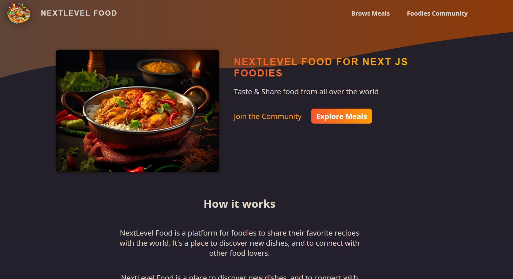
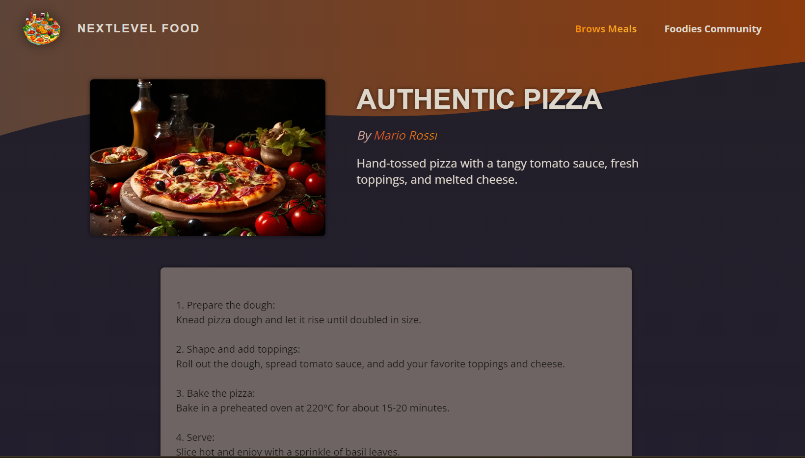
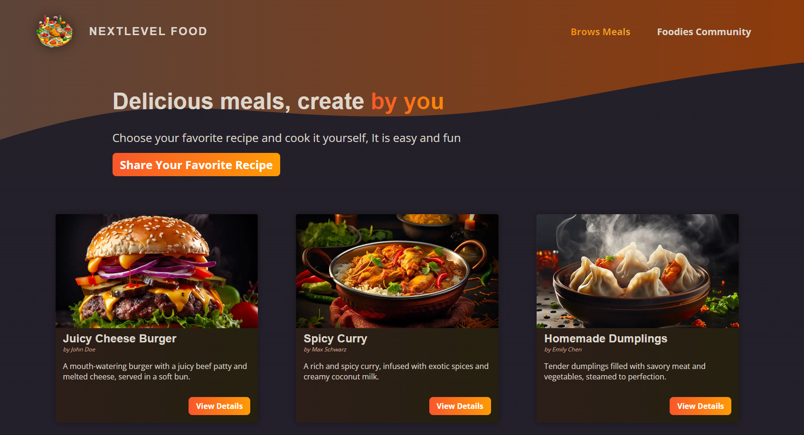
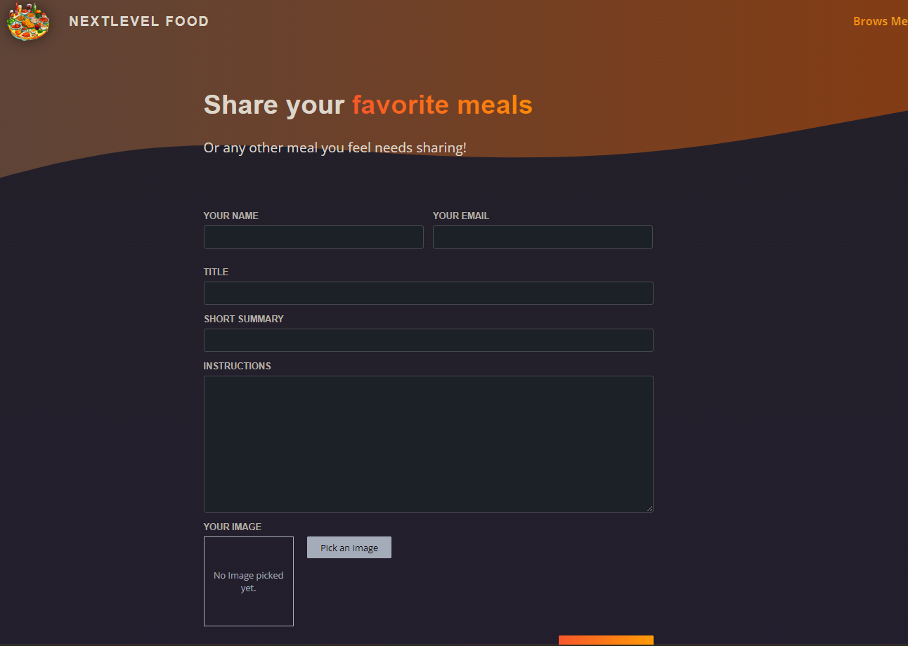

# Next Js Food blog App

# Functionality of this app

allow users to browse through the meal recipe and user can add new recipe to the blog.

# Installation

- project will only run locally for the education purpose
- download or clone repository - [Next Js Food Blog](https://github.com/kartavya99/foodblog_nextjs)
- NodeJS is required to run the application

## Getting Started

- run npm install & npm run dev
- Open [http://localhost:3000](http://localhost:3000) with your browser to see the result.
- You can start editing the pages by modifying. The page auto-updates as you edit the file.

## Home Page

## Single Meal Page

## Community Page

## Meal Share Page

## Deploy on Vercel

The easiest way to deploy your Next.js app is to use the [Vercel Platform](https://vercel.com/new?utm_medium=default-template&filter=next.js&utm_source=create-next-app&utm_campaign=create-next-app-readme) from the creators of Next.js.

Check out our [Next.js deployment documentation](https://nextjs.org/docs/deployment) for more details.
